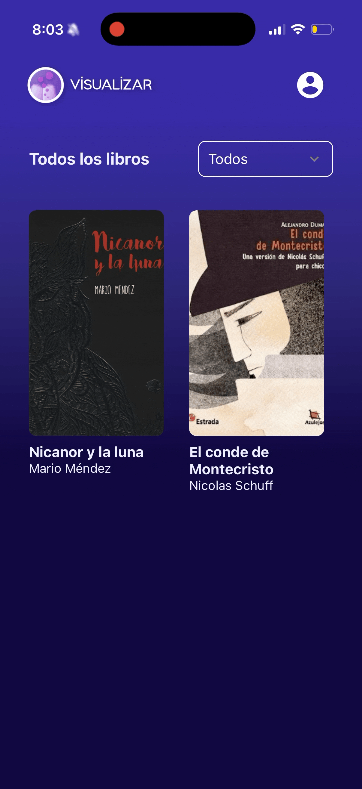
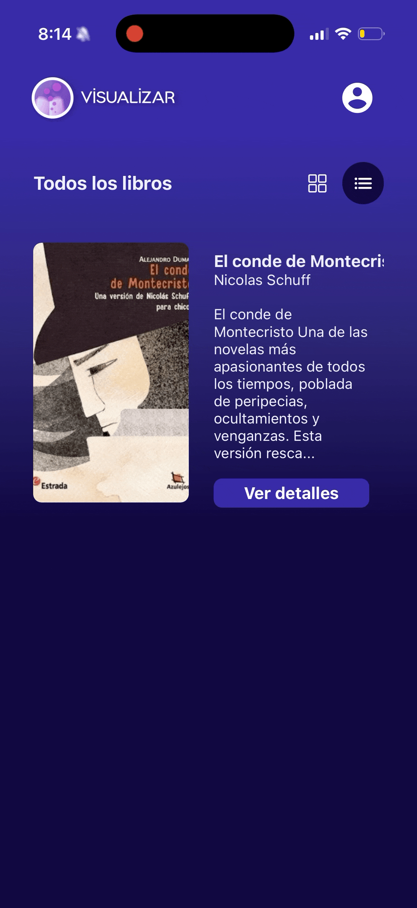

<div align="center">


# Visualizar - by Matias Santillan

[About](#-about) ✦ [Tech Stack](#-tech-stack) ✦ [Getting Started](#-getting-started) ✦ [Commands](#-commands) ✦ [How it Works](#-how-it-works) ✦ [Demo](#-demo) ✦ [License](#-license)

</div>

## 📖 About

**Visualizar** is a mobile application built as a university thesis project with a clear mission: **inspire elementary school children to read more** by bringing their favorite book characters to life through Augmented Reality.

The app connects students and teachers in a shared reading experience. Students can browse the books assigned for their course and, with a single tap, visualize the main characters of each book as interactive 3D models right on their device. They can rotate, scale, and explore the characters using touch gestures — turning reading from a passive activity into a hands-on, immersive adventure.

Teachers, on the other hand, can do everything a student can do, plus manage the books available for each course and request new books to be added to the catalog.

## 🛠 Tech Stack

| Technology                                                                                                                                                | Purpose                                                                                                                                                                                                                        |
| --------------------------------------------------------------------------------------------------------------------------------------------------------- | ------------------------------------------------------------------------------------------------------------------------------------------------------------------------------------------------------------------------------ |
| [React Native](https://reactnative.dev/) + [Expo](https://expo.dev/) (v54)                                                                                | Cross-platform mobile framework. Expo provides a managed workflow with access to native APIs, fast iteration with hot reload, and a rich ecosystem of modules — ideal for rapid development without native toolchain overhead. |
| [Expo Router](https://docs.expo.dev/router/introduction/) (v6)                                                                                            | File-based routing. Mirrors the intuitive routing paradigm popularized by Next.js, making navigation predictable and easy to maintain.                                                                                         |
| [Three.js](https://threejs.org/) + [expo-three](https://github.com/nicktomlin/expo-three) + [expo-gl](https://docs.expo.dev/versions/latest/sdk/gl-view/) | 3D rendering engine. Three.js is the most mature WebGL library available, and combined with `expo-three` and `expo-gl`, it allows us to render FBX, GLTF/GLB, and OBJ 3D models natively inside React Native.                  |
| [@react-three/fiber](https://docs.pmnd.rs/react-three-fiber) + [@react-three/drei](https://github.com/pmndrs/drei)                                        | React declarative layer for Three.js. Lets us compose 3D scenes using React components with built-in helpers for lighting, cameras, and controls.                                                                              |
| [TanStack React Query](https://tanstack.com/query) (v5)                                                                                                   | Server state management. Handles caching, background refetching, and request deduplication — keeping the app responsive and in sync with the backend.                                                                          |
| [react-hook-form](https://react-hook-form.com/) + [Zod](https://zod.dev/)                                                                                 | Form handling and validation. Provides performant, uncontrolled form management with schema-based validation for type safety at runtime.                                                                                       |
| [Supabase](https://supabase.com/)                                                                                                                         | Authentication via email OTP. Supabase provides a simple, secure passwordless login flow that is ideal for young students who may not manage complex passwords.                                                                |
| [React Native Paper](https://reactnativepaper.com/) + [RNEUI](https://reactnativeelements.com/)                                                           | UI component libraries for polished, accessible, and consistent interface elements out of the box.                                                                                                                             |

## 🚀 Getting Started

### Prerequisites

- [Node.js](https://nodejs.org/) (v18 or higher)
- [Expo CLI](https://docs.expo.dev/get-started/installation/)
- [Expo Go](https://expo.dev/go) app installed on your physical device (recommended for 3D features)

### Installation

1. Clone the repository:

   ```bash
   git clone https://github.com/Matisantillan11/visualizar.git
   cd visualizar
   ```

2. Install dependencies:

   ```bash
   pnpm install
   ```

3. Set up environment variables:

   Create a `.env` file in the root directory with the required variables:

   ```bash
   EXPO_PUBLIC_SERVICES_URL=<your_api_base_url>
   EXPO_PUBLIC_TOKEN=<your_supabase_token>
   ```

4. Start the development server:

   ```bash
   pnpm start
   ```

5. Scan the QR code with the **Expo Go** app on your device, or press `i` for iOS simulator / `a` for Android emulator.

## 🧞 Commands

| Command                  | Action                             |
| ------------------------ | ---------------------------------- |
| `pnpm start`             | Start the Expo development server  |
| `npm run ios`            | Start the app on iOS simulator     |
| `pnpm run android`       | Start the app on Android emulator  |
| `pnpm run web`           | Start the app in the web browser   |
| `pnpm run lint`          | Run the linter with Expo's config  |
| `pnpm test`              | Run tests in watch mode with Jest  |
| `pnpm run reset-project` | Reset the project to a clean state |

## 📝 How it Works

### Authentication

The app uses a **passwordless email OTP** flow powered by Supabase. Students and teachers simply enter their email, receive a 6-digit verification code, and they're in — no passwords to remember.

### Role-based Experience

Once logged in, the app adapts to the user's role:

- **Students** see the books assigned to their specific course. They can browse the catalog, view book details, and tap into the AR experience to see 3D characters.
- **Teachers** can view books across all their courses and manage the book catalog.

### 3D / AR Visualization

This is the core feature. Each book can have associated 3D models (FBX, GLTF/GLB, or OBJ format) representing its main characters. When a student opens the AR view:

1. The model is preloaded using a dedicated context for smooth performance.
2. A full-screen 3D scene renders with realistic lighting (ambient, hemisphere, and point lights).
3. Users can **pinch to scale**, **drag to rotate**, and switch between **perspective and isometric** camera views.
4. Model animations (like idle rotations) bring the characters to life.

### Book Requests

Teachers can request new books to be added to their course catalog through a form validated with Zod schemas. Administrators can then review and manage these requests through the [admin panel](https://github.com/Matisantillan11/visualizar-next-dashboard).

## 🎬 Demo

### Teacher Experience

<div style="max-width: 650px; display: flex; flex-direction: row; flex-wrap: wrap; gap: 4px; justify-content: center; align-items: center;">
   

   

   

   
</div>

### Student Experience

<div style="max-width: 650px; display: flex; flex-direction: row; flex-wrap: wrap; gap: 4px; justify-content: center; align-items: center;">
   

   
</div>

## 🔑 License

Created by [Matias Santillan](https://github.com/Matisantillan11) as a university thesis project.
